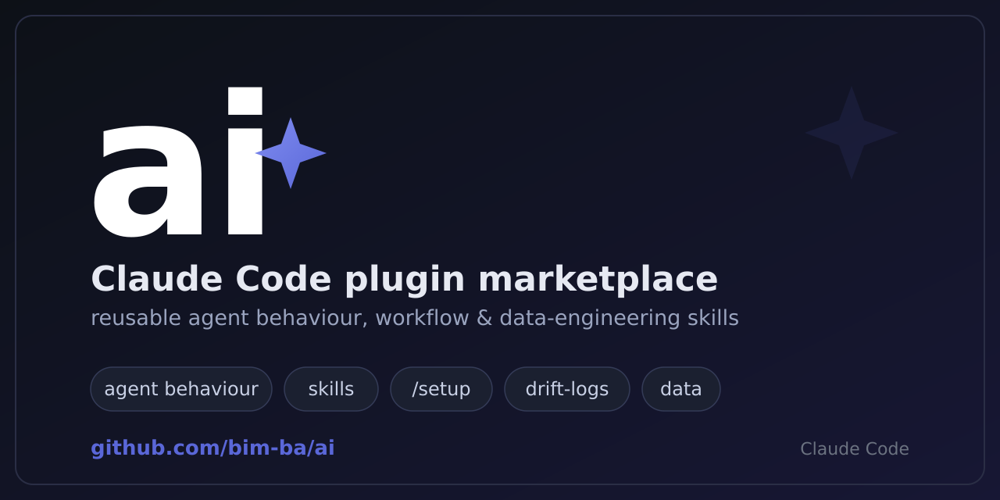

<p align="center">
  
</p>

# ai

[](LICENSE)
[](https://docs.claude.com/en/docs/claude-code)
[](https://github.com/bim-ba/ai/actions/workflows/ci.yml)

A Claude Code plugin marketplace providing reusable agent behavior, project scaffolding, and data-engineering skills.

<p align="center">
  
</p>

## Requirements

- [`uv`](https://docs.astral.sh/uv/) — **required** for Claude Code. The `core` SessionStart hook and the `/setup` scripts run Python through `uv run`. Without `uv`, both `core` hooks are skipped -- the SessionStart behaviour-protocol injection AND the Stop drift-log reminder (the session still works, silently).
- **Claude Code** — install via the marketplace (below).

## Install

**Claude Code** — add the marketplace, then enable the plugins you need:

```
/plugin marketplace add bim-ba/ai
```

`core` for any project, `data` for data projects.

## Domains

| Domain | Purpose | Enable when |
|--------|---------|-------------|
| `core` | Generic agent behavior (injected each session), reusable workflow skills, the `/setup` scaffolder, and project templates. | Always — it is the baseline for any project. |
| `data` | Data-engineering rulebook skills (ClickHouse / federated-query practices). | Working in a dbt / ClickHouse data project. |

## Skills

| Skill | Domain | What it does | Triggers |
|-------|--------|--------------|----------|
| `setup` | core | Bootstraps a project with ai conventions (drift-log dirs, a thin CLAUDE.md + AGENTS.md, plugin wiring). Idempotent. | Manual: `/setup` |
| `creating-drift-logs` | core | Captures a divergence between actual behavior and codified instructions as an immutable drift-log entry, so good conventions can be promoted later. | Auto (8 drift triggers); the Stop hook reminds once at the end of each turn |
| `reviewing-drift-logs` | core | Triages the drift-log — promotes open→applied, checks staleness, compacts entries, codifies insights into rules. | Manual |
| `reviewing-agent-instructions` | core | Audits the agent-instruction surface (CLAUDE.md, skills, drift-log, hooks) for pollution, duplication, dead refs, and contradictions. Report-only, no auto-fix. | Manual |
| `researching-rigorously` | core | Rigorous research / validation / fact-check: fans out parallel subagents per source, cross-validates via MCP + web, and cites sources. | Auto on research / validation tasks |
| `documenting-meetings` | core | Turns an SRT audio transcript into structured meeting notes (decisions, action items, discussion summary). | Manual |
| `handling-secrets-safely` | core | Structural safeguards for secret-bearing files -- never edit them through tools, boolean/count probes only, indirection instead of literals. | Auto when a task touches credentials |
| `thinning-agent-instructions` | core | Cuts an over-grown instruction surface back to what is load-bearing, without losing a rule that is still earning its place. | Manual |
| `using-playwright` | core | Drives web UIs through the Playwright MCP — SSO login, Monaco/textarea editors, content extraction. | Auto when using the Playwright MCP |
| `clickhouse-query-best-practices` | data | Rulebook for ad-hoc research SQL in dbt-ClickHouse and federated `postgresql()` queries (CTE-wrapping, dedup, flow analysis, source citation, style). | Auto when writing / reviewing ClickHouse SQL |

## Hooks (core)

| Hook | What it does | When |
|------|--------------|------|
| `SessionStart` | Injects the `core` behaviour protocol (`behaviour-protocol.md`) as baseline conventions for the session. | Every session / subagent start |
| `Stop` | Reminds the agent to scan the last turn against the 8 drift triggers and log an entry if any fired. | When the agent finishes a turn |

## Quickstart

In any project:

```
/setup                   # enable just core
/setup --with core,data  # enable core + data
/setup --with data       # same as above — core is always enabled
```

`/setup` creates the drift-log directories, a skills-authoring standard, a thin `CLAUDE.md` (+ `AGENTS.md` symlink), and wires the `ai` marketplace into `.claude/settings.json`. It is idempotent — safe to re-run.

## MCP configuration

The repo ships an `.mcp.example.json` with the MCP servers used during development:

| Server | Purpose | API key |
|--------|---------|---------|
| `context7` | Up-to-date library / framework / API documentation. | `CONTEXT7_API_KEY` (optional) |
| `deepwiki` | Q&A over public GitHub repository docs. | none |
| `brave` | Web search. | `BRAVE_API_KEY` |
| `github` | GitHub repository / PR / issue operations (Copilot MCP endpoint). | `GITHUB_PAT` |

To use it:

```
cp .mcp.example.json .mcp.json
```

Then export the referenced environment variables. `.mcp.json` is git-ignored — never commit real keys.

## Contributing

- Work happens on feature branches.
- New skills follow `plugins/core/templates/skills-authoring-standard.md`.
- Specs and plans live in `docs/superpowers/`.

## CI

- **CI** (`.github/workflows/ci.yml`) runs on every push/PR to `main`: the `/setup` Python suite across `ubuntu`/`macos`/`windows` × Python 3.9–3.13. This is the merge gate.

## License

[MIT](LICENSE) © 2026 Sava Znatnov
